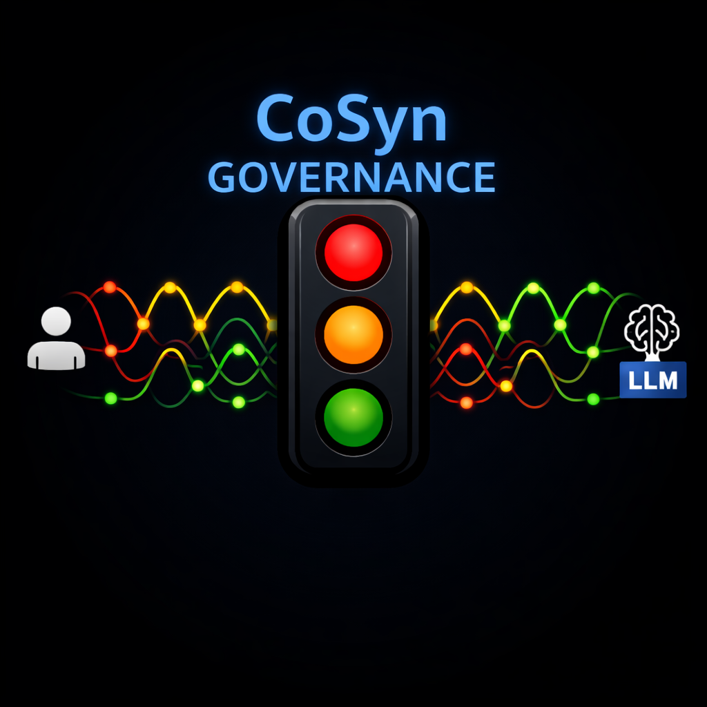

# CoSyn Governance EXE — Legal (v5-legal)

<p align="center">
  
</p>

Local-LLM build of the CoSyn Governance EXE for legal professional services. Enforces constitutional governance over all user-to-LLM interaction using a local inference server. No client data leaves the machine.

> **v4.x (cloud LLM) version:** [cosyn-governance-exe](https://github.com/SEGaither/cosyn-governance-exe)

## What It Does

Every user prompt passes through a deterministic governance pipeline before reaching the local LLM, and every LLM response passes through constitutional enforcement before reaching the user. The system fails closed on any invalid condition.

```
User -> [Input Gate] -> [Local LLM] -> [Output Governance] -> [Release or Block]
```

**Domain:** Legal professional services
**Operator model:** Paralegal (primary operator), Attorney (oversight and review)
**Deployment:** Single workstation, local only (Ubuntu LTS)

**Input Gate:** Subject binding, evidence evaluation, ambiguity detection, version truth check, data classification enforcement (Model C: Hybrid Controlled Recognition).

**Output Governance:** Structural grounding, semantic grounding, constitutional enforcement (7 checks), sentinel detection. On failure, the system retries with specific failure feedback (up to 2 revisions), then permanently blocks.

**Authority:** Three governance artifacts are embedded at compile time:
- CoSyn Constitution v15.1.0
- Persona Governor v2.4.2
- Stack Architect v2.3.2

## v5-legal Additions (Planned)

- **Local LLM backend** — Ollama-based, no external API calls for client work
- **Data classification** — Client / Internal / External, enforced at code level
- **Session isolation** — No cross-session data leakage
- **Controlled external access** — Internet research with client data blocked from outbound
- **Enhanced telemetry** — ABA compliance auditing support

## Quick Start

> **Status:** v5.0.0-dev — not yet ready for use. See [v4.1.1](https://github.com/SEGaither/cosyn-governance-exe/releases/tag/v4.1.1) for the current stable release.

## Building from Source

**Requirements:** Rust toolchain (edition 2021)

```bash
cargo build --release
```

Binaries output to `target/release/`:
- `cosyn.exe` (GUI)
- `cosyn-cli.exe` (CLI)

## Running Tests

```bash
cargo test
```

30 tests across 4 suites (governance layer, DCC enforcement, audit records, telemetry events). Two tests are ignored by default (require a running local Ollama server). To run all tests including live inference:

```bash
# Ensure Ollama is running at localhost:11434 with the target model loaded
cargo test -- --ignored
```

## Architecture

See [ARCHITECTURE.md](ARCHITECTURE.md) for the full pipeline specification.

## Governance Artifacts

The `governance/` directory contains the constitutional documents this EXE enforces:

- `governance/artifacts/` — Embedded authority files (compiled into the binary)
- `governance/constitution/` — CoSyn Constitution v15.1.0 (reference copy)
- `governance/legal/` — Legal framework (patents, trademark, fork policy, security)
- `governance/glossary.md` — Terminology reference

## Project History

This repo is the v5-legal line of the CoSyn Governance EXE, forked-by-copy from [cosyn-governance-exe v4.1.1](https://github.com/SEGaither/cosyn-governance-exe/releases/tag/v4.1.1). The v4.x line continues as the cloud-LLM (OpenAI) version. The v5.x line is the local-LLM-with-governance line for legal professional services.

The original Python/FastAPI middleware reference implementation lives at [cosyn-runtime-wrapper](https://github.com/SEGaither/cosyn-runtime-wrapper).

Build history and technical details are in `docs/build-reports/`.

## License

Source Available License for non-commercial use. Commercial use requires a separate license agreement. See [LICENSE](LICENSE) and [LICENSE-COMMERCIAL](LICENSE-COMMERCIAL).

## Contributing

See [CONTRIBUTING.md](CONTRIBUTING.md). All contributions must comply with the CoSyn Constitution and governance architecture.

## Security

Report vulnerabilities to cosyn.dce@gmail.com. See [governance/legal/SECURITY.md](governance/legal/SECURITY.md).

## Contact

- Shane Gaither
- cosyn.dce@gmail.com
- [Substack](https://substack.com/@shanegaither/posts)
